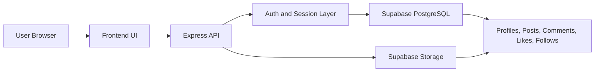

# SocialSphere

<p align="center">
	
	
	
	
</p>

SocialSphere is a modern social media web application built with a Node.js and Express backend, a Supabase PostgreSQL database, and a clean vanilla HTML, CSS, and JavaScript frontend.

## Overview

The project covers the core social workflow: sign in, build a profile, publish posts, like and comment, and follow other users. The backend serves the frontend and exposes a REST API that powers the full experience.

## Key Features

- User registration and login
- Profile creation and editing
- Create, edit, and delete posts
- Like and comment on posts
- Follow and unfollow users
- Feed-driven browsing experience

## Tech Stack

<p align="center">
	
</p>

| Layer | Technology |
| --- | --- |
| Frontend | HTML5, CSS3, Vanilla JavaScript |
| Backend | Node.js, Express.js |
| Database | Supabase PostgreSQL |
| Authentication | Supabase Auth |
| Storage | Supabase Storage |
| Session management | express-session |


## Application Pipeline



## Requirements

- Node.js 18 or newer
- A Supabase project with database access

## Setup

1. Install backend dependencies:

```bash
cd backend
npm install
```

2. Create a `backend/.env` file and add your configuration values:

```env
PORT=5000
NODE_ENV=development
SESSION_SECRET=your_long_random_string_here

SUPABASE_URL=your_supabase_project_url
SUPABASE_ANON_KEY=your_supabase_anon_key
SUPABASE_SERVICE_KEY=your_supabase_service_role_key
DATABASE_URL=your_supabase_postgres_connection_string
```

3. Start the application:

```bash
npm run dev
```

4. Open the app in your browser:

```text
http://localhost:5000
```

## Environment Notes

- Keep `SUPABASE_SERVICE_KEY` private.
- Use a strong `SESSION_SECRET`.
- The server prints startup diagnostics if any required environment value is missing.

